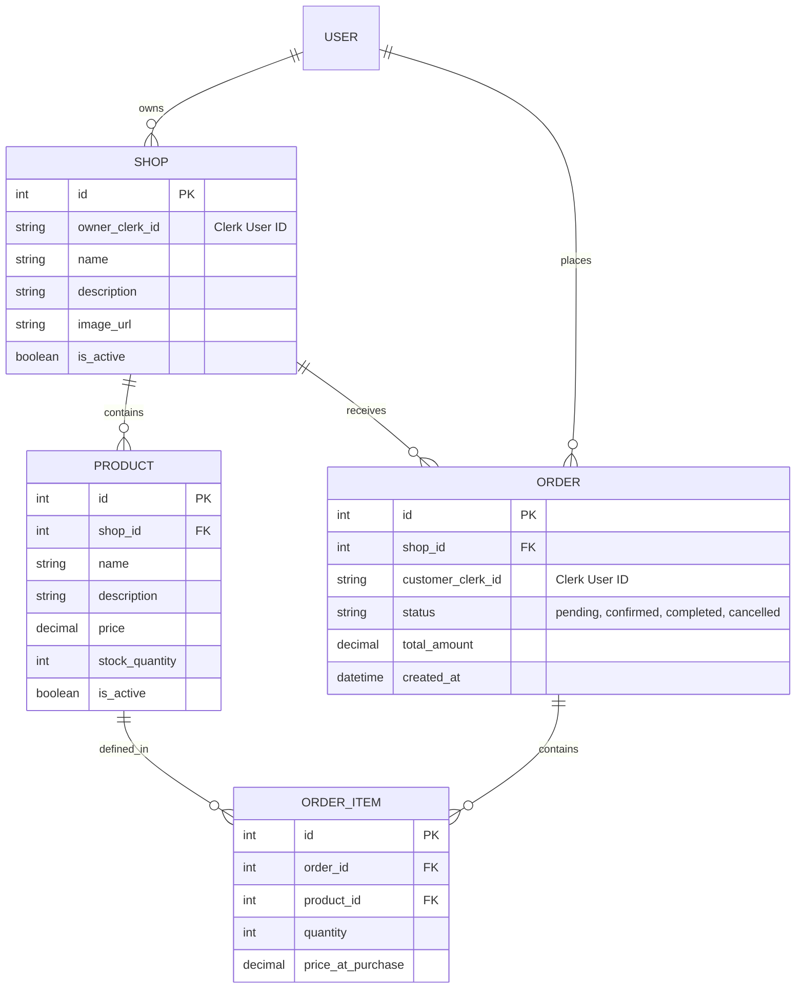

# Data Model: Gul Plaza Baseline

## Entity Relationship Diagram (ERD)

## Schema Definitions (SQLModel)

### Shop
- **Constraints**: `owner_clerk_id` is unique (One shop per owner for MVP simplicity, or One-to-Many? Spec doesn't strictly limit, but "Shop Owner" usually implies 1-1 relationship for simplicity. Let's allow One-to-Many but enforce at least one).
- **Isolation**: Queries MUST filter by `owner_clerk_id` for Shop Owners.

### Order
- **Status Enum**: `PENDING`, `CONFIRMED`, `SHIPPED`, `COMPLETED`, `CANCELLED`.
- **Isolation**: 
  - Shop Owner sees `Order.shop_id == self.shop_id`.
  - Customer sees `Order.customer_clerk_id == self.id`.

### Product
- **Constraints**: Price > 0, Stock >= 0.
